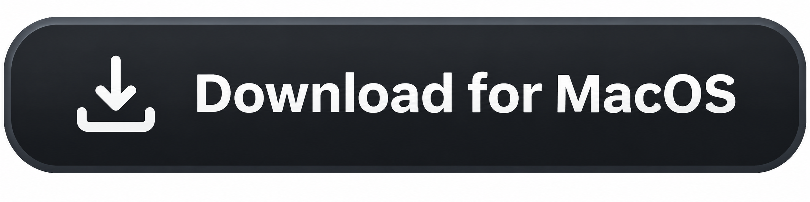
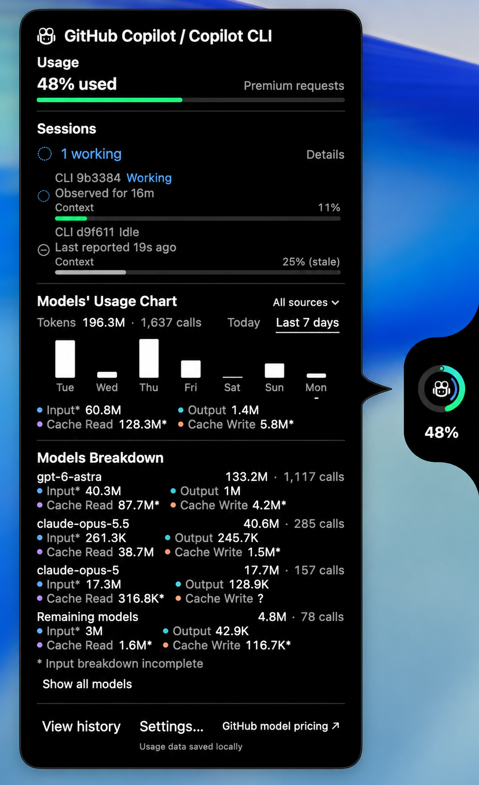
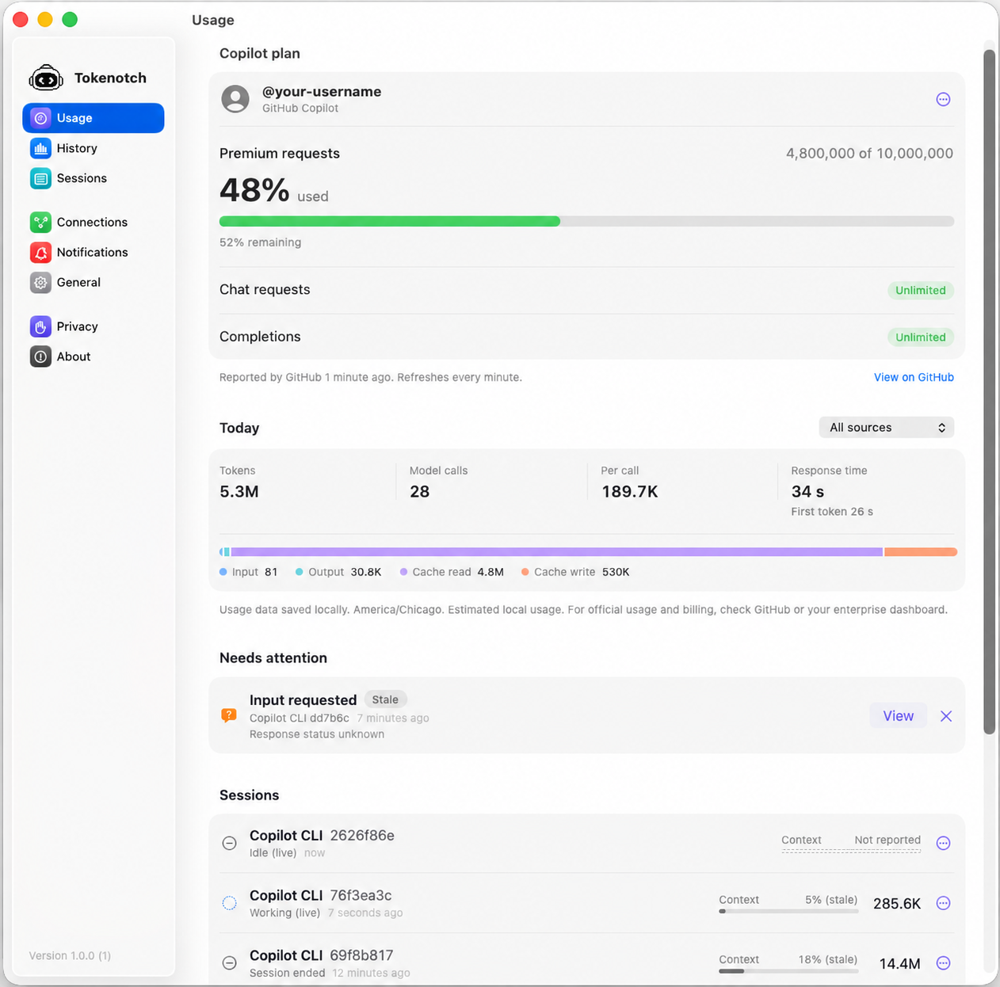
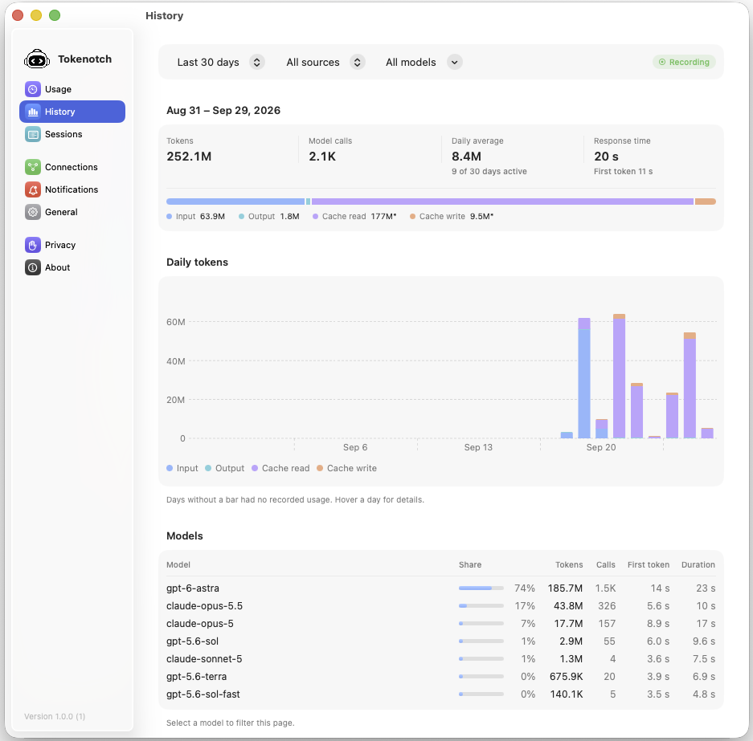
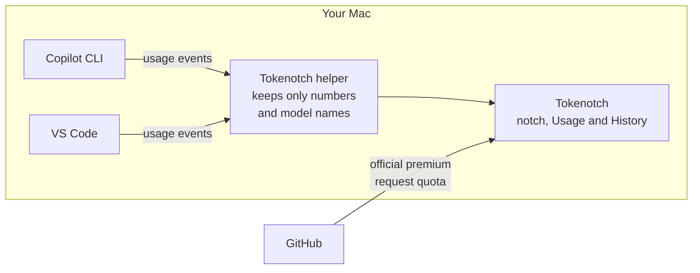

<!-- markdownlint-disable MD041 -->

<picture>
  <source media="(prefers-color-scheme: dark)" srcset="sources/Resources/Brand/TokenotchMarkDark.png">
  
</picture>

# Tokenotch

**Your AI coding usage, at a glance, right in your Mac's notch.**

Track tokens, models and live Copilot sessions across GitHub Copilot CLI and
VS Code, and get a nudge the moment a session needs you.

Free and open source · macOS 15+ · <a href="https://github.com/rottathiago/tokenotch/releases">All releases</a>

  <a href="#why-tokenotch">Why Tokenotch</a> ·
  <a href="#how-it-works">How it works</a> ·
  <a href="#requirements">Requirements</a> ·
  <a href="#roadmap-and-updates">Roadmap</a> ·
  <a href="#contributing">Contributing</a>

## What is Tokenotch?

Tokenotch is a small macOS app that lives in your screen's notch. It quietly
watches the GitHub Copilot sessions you run in **Copilot CLI** and **VS Code**,
then turns what it sees into simple stats: how many tokens you use, which
models you use them on, how full each session's context window is, and which
session is waiting on you.

No dashboards to open, no tabs to refresh. Glance up and you know.

## Why Tokenotch

| | Benefit | What you get |
| :---: | --- | --- |
| 👀 | **Usage at a glance** | Premium request usage and today's tokens, always one hover away in the notch. |
| 🧠 | **Know your models** | Tokens and calls per model, split into input, output, cache read and cache write. |
| 🔔 | **Never miss a prompt** | Run several agents at once; Tokenotch tells you when one is done or needs your input. |
| 📏 | **Context before it's too late** | A context-window bar under every session shows how close it is to the limit. |
| 📈 | **Spot your patterns** | Optional history with daily token charts, model share and response times. |
| 🔒 | **Private by design** | No backend, no analytics. Prompts and code are never stored; everything stays on your Mac. |

## See it in action

<table>
  <tr>
    <td align="center" width="50%">
      
    </td>
    <td align="center" width="50%">
      
    </td>
  </tr>
  <tr>
    <td align="center"><b>Usage:</b> your Copilot plan, today's tokens and calls, and every live session in one place.</td>
    <td align="center"><b>History:</b> daily tokens, model share and response times over time.</td>
  </tr>
</table>

## How it works

Think of Tokenotch as a **trip meter** for your AI coding. Your car's official
odometer (GitHub) keeps the real total; the trip meter (Tokenotch) counts what
happens while it is switched on, so you can see where the miles go.

1. **Your Copilot tools report activity.** While you work, Copilot CLI and
   VS Code emit small usage events on your Mac, such as "this call used model X
   and N tokens". After you approve it in setup, Tokenotch connects a small
   extension to the CLI and a local listener to VS Code to receive them.
2. **Tokenotch keeps the numbers and drops the rest.** A local helper strips
   everything except token counts, model names, timings and hashed session IDs. Your prompts, code, responses and file names are thrown away before
   anything is saved. Tokenotch does not read your log files or chat transcripts.
3. **The numbers become stats.** Tokenotch adds the numbers up per session, per
   model and per day, and shows them in the notch. If you turn on history, daily
   totals are saved in a private folder on your Mac.

Want the full picture? The [architecture overview](docs/architecture.md) walks
through every step with diagrams and links to the code, so you can verify it
yourself.

### Where each number comes from

| Number | Source | Accuracy |
| --- | --- | --- |
| **Premium requests used** | **Official**: reported by GitHub through the official Copilot CLI after you sign in, refreshed every minute | Matches your GitHub account |
| **Tokens, models, calls, response time** | **Local estimate**: counted from events seen locally while Tokenotch is running | Accurate when Tokenotch is running from the start of every Copilot session |
| **Session state and context** | **Local**: reported by the Copilot client running each session | Live, may be marked stale |

> [!IMPORTANT]
> **GitHub is the source of truth for your usage, limits and billing.** We
> strongly recommend checking your official numbers on GitHub; see
> [monitoring your premium requests](https://docs.github.com/en/copilot/how-tos/manage-and-track-spending/monitor-premium-requests).
> Tokenotch's token and model stats come from what it observes locally, **not**
> from GitHub's official usage pages. Anything you do while Tokenotch is closed,
> on another computer, or in an unsupported tool is not counted, and it cannot
> be filled in later. **Start Tokenotch before you start coding** to get the
> most complete picture.

## Tokenotch vs. checking manually

| | Checking manually | With Tokenotch |
| --- | --- | --- |
| **Where you look** | Open a browser and find the usage page | Glance at the notch |
| **Tokens per model** | Hard to compare across sessions | Input, output and cache per model |
| **Several agents at once** | Switch between terminals and windows | Every session in one list, with state |
| **Knowing when you're needed** | Keep checking each window | Notch alert and optional notification |
| **Context window** | Ask each session | Live bar under each session |
| **Trends over time** | Not available locally | Optional daily history and model share |
| **Official billing and limits** | ✅ Source of truth | Shows GitHub's premium request quota; always confirm on GitHub |

## Requirements

| | Requirement | Notes |
| :---: | --- | --- |
| 💻 | **macOS 15 or later** | Apple Silicon or Intel |
| 🤖 | **GitHub Copilot** | An active Copilot plan on your GitHub account |
| ⌨️ | **GitHub Copilot CLI** and/or **VS Code** | At least one, installed on the same Mac. VS Code 1.138.0 or later |
| 📊 | **Copilot CLI sign-in** *(optional)* | Needed only to show your official premium request usage; uses the Copilot CLI even if you code in VS Code |

Releases are currently unsigned, so macOS may block the first launch. If you
trust the download, choose **Open Anyway** in **System Settings > Privacy &
Security** ([why?](docs/support.md#unsigned-downloads)). Installation, setup,
updates and uninstalling are covered in [Getting started](docs/getting-started.md)
and [Support](docs/support.md).

## Privacy

Tokenotch has **no backend, no analytics and no automatic crash reporting**. Prompts,
code and responses are discarded before anything is saved, and every optional
feature (history, timelines, notifications, account quota) is off until you turn
it on. Read the details in [Privacy and retention](docs/tokenotch-privacy.md)
and the [architecture overview](docs/architecture.md).

## Roadmap and updates

Tokenotch is actively developed and **will be updated as new features ship**.
On the way:

- 🪟 **Windows port**: Tokenotch beyond the Mac.
- 🔌 **More providers**: support for more AI coding assistants and tools.

⭐ **Star** the repo and choose **Watch > Custom > Releases** to hear about each
new version. You can also use **Check for Updates** in the app at any time.

## Contributing

Contributions of all sizes are welcome: bug reports, ideas, docs and code.

- 🐛 **Found a bug or have an idea?** [Open an issue](https://github.com/rottathiago/tokenotch/issues/new/choose).
- 📝 **Docs changes** don't need Xcode; just run `make docs-check`.
- 🛠️ **Code changes**: build with `make build` and test with `make test`.

Start with the [contributing guide](CONTRIBUTING.md), the
[feature reference](docs/features.md) and [release readiness](TASKS.md).
Please report security issues privately as described in [SECURITY.md](SECURITY.md).

---

Tokenotch is an independent project and is not affiliated with or endorsed
by GitHub or Microsoft. Copyright (c) 2026 rottathiago, released under the
[MIT License](LICENSE). Includes MIT-licensed code, Copyright (c) 2026 Vinz;
the original copyright and permission notice are preserved in [LICENSE](LICENSE)
and distributed with the app and companion.
