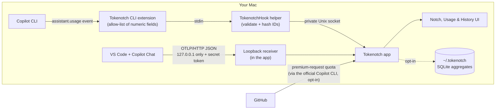
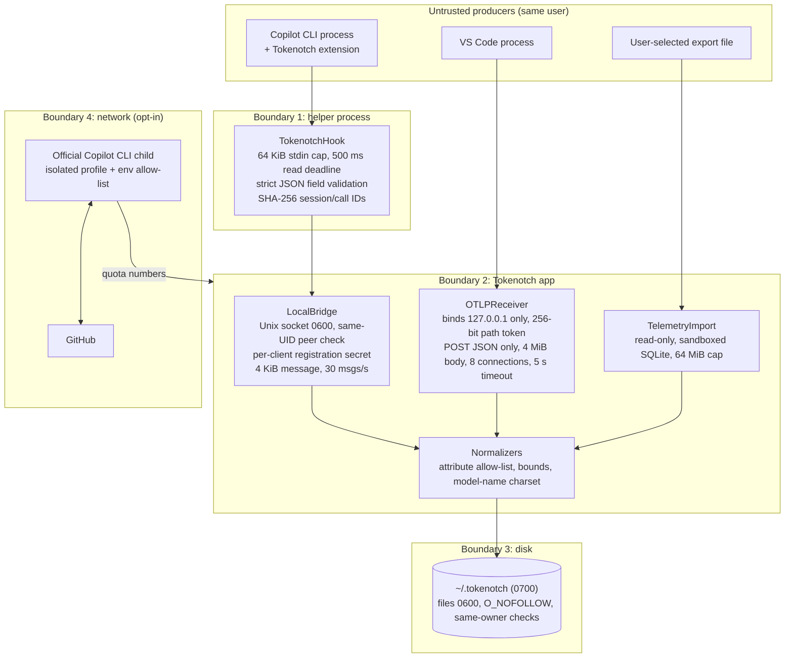
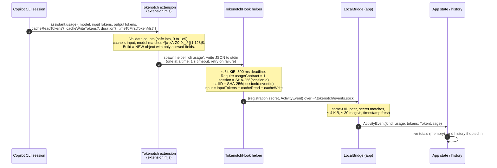
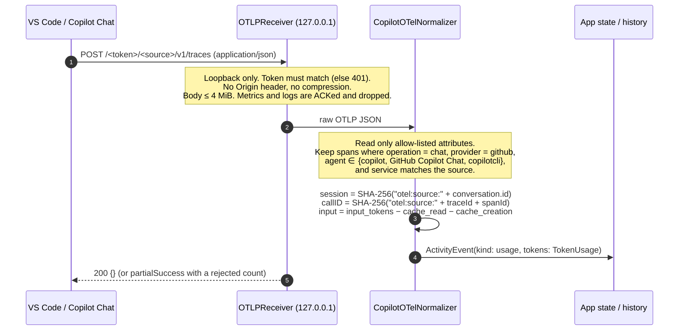
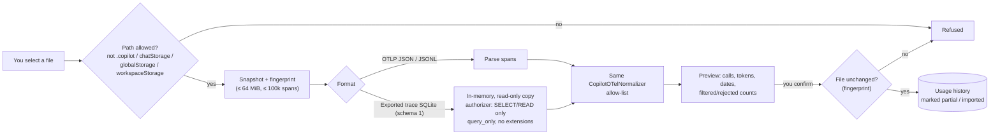
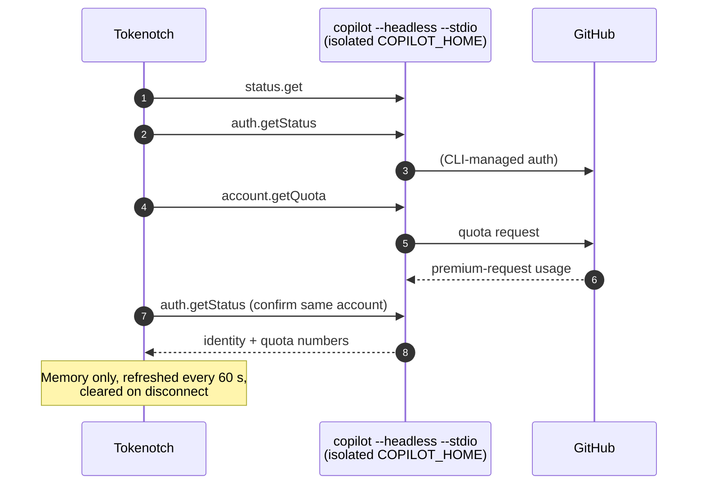
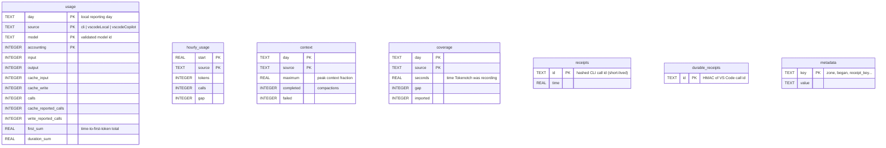

# Tokenotch architecture

This document explains how Tokenotch captures model and token usage and what it
keeps and what it discards. Readers can check each claim against the source code.

- **Short version:** read [At a glance](#at-a-glance).
- **Technical detail:** each later section describes one part of the system and
  links to the code that implements it.

> [!NOTE]
> Code links point to files and line numbers in the current source tree. Line
> numbers can shift between versions, so each link also names the function or
> symbol. When the prose and the code disagree, the code is authoritative.
> Detailed wire contracts live in
> [integration contracts](tokenotch-integrations.md), and retention rules live in
> [privacy and operations](tokenotch-privacy.md).

## Contents

1. [At a glance](#at-a-glance)
2. [Components](#components)
3. [Trust boundaries and threat model](#trust-boundaries-and-threat-model)
4. [Copilot CLI usage capture](#copilot-cli-usage-capture)
5. [VS Code usage capture](#vs-code-usage-capture)
6. [Historical telemetry import](#historical-telemetry-import)
7. [Premium-request quota (the GitHub call)](#premium-request-quota-the-github-call)
8. [Session lifecycle and notification hooks](#session-lifecycle-and-notification-hooks)
9. [What is kept, hashed or discarded](#what-is-kept-hashed-or-discarded)
10. [Local storage](#local-storage)
11. [Install and uninstall footprint](#install-and-uninstall-footprint)
12. [Verify it yourself](#verify-it-yourself)
13. [Code reference index](#code-reference-index)

---

## At a glance

Tokenotch is a **trip meter** for your AI coding. Copilot already reports a
small usage event after each model call, such as "this call used model X, 1,200
input tokens and 45 output tokens." Tokenotch listens for those events **on your
Mac**, keeps only the numbers and the model name, and adds them up.

Three guarantees shape the design:

| Guarantee | What it means in practice |
| --- | --- |
| 🏠 **Local only** | Usage events travel only between processes on your Mac, through a private Unix socket or a loopback-only (`127.0.0.1`) listener. Tokenotch has no backend and sends no analytics. |
| 🔢 **Numbers only** | Each event is reduced to token counts, model name, timings and **hashed** identifiers before the app stores it. Prompts, responses, code, file names and raw telemetry are discarded. |
| 🎛️ **You're in control** | Every integration is opt-in, and each one can be removed on its own. Saved history and timelines are separate opt-ins, and you can delete them. |



> [!IMPORTANT]
> Token and model numbers are **local observations**. They are not GitHub's
> billing records. Usage is missing whenever Tokenotch is closed, when you work
> on another machine, or when you use an unsupported client. **GitHub remains the
> source of truth** for usage, limits and billing.

---

## Components

| Component | Where | Role |
| --- | --- | --- |
| **Tokenotch app** | [`sources/App`](../sources/App), [`sources/Notch`](../sources/Notch), [`sources/Settings`](../sources/Settings) | The menu-bar/notch app, which provides the UI, settings, history controller and setup flows. |
| **Core library** | [`sources/Core`](../sources/Core) | Validation, normalization, the local bridge, the OTLP receiver, storage and imports. |
| **`TokenotchHook` helper** | [`sources/Hook/TokenotchHook.swift`](../sources/Hook/TokenotchHook.swift) | A small command-line binary. Copilot runs it for each hook or usage event. It reads one message from stdin, normalizes it and forwards it to the app. |
| **Copilot CLI usage extension** | [`integrations/CopilotUsage/extension.mjs`](../integrations/CopilotUsage/extension.mjs) | A Copilot SDK extension installed into `~/.copilot/extensions`. It subscribes to usage, context and compaction events and forwards only allowed numeric fields to the helper. |
| **VS Code setup companion** | [`integrations/VSCode`](../integrations/VSCode) | An optional sideloaded VS Code extension. It writes a small, documented set of **public** settings, including the OTel exporter pointing at the local receiver, `captureContent: false`, and the hook folder. It records ownership so that removal restores only what it changed. |

---

## Trust boundaries and threat model

Tokenotch handles input from other processes. It treats every incoming event as
**untrusted**, and it validates each event again at every boundary it crosses.



### What the design protects against

| Threat | Mitigation | Code |
| --- | --- | --- |
| Prompt/code content ends up on disk | Allow-lists at the extension, helper and normalizer layers keep only numeric fields and a validated model name. No raw payloads are persisted. | [`extension.mjs` `assistant.usage`](../integrations/CopilotUsage/extension.mjs#L228-L260), [`HookNormalizer`](../sources/Core/Activity.swift#L123-L293), [`CopilotOTelNormalizer.allowedAttributes`](../sources/Core/CopilotOTelNormalizer.swift#L16-L22) |
| Another machine sends telemetry | The receiver binds to `127.0.0.1` only. | [`OTLPReceiver.start`](../sources/Core/OTLPReceiver.swift#L148-L191) |
| Another local app posts fake telemetry | Each installation has a random 256-bit token in the URL path, and requests with a wrong token get `401`. Browser-style requests (`Origin` header) are rejected. | [`TelemetryConfiguration`](../sources/Core/OTLPReceiver.swift#L5-L25), [`OTLPRequest.parse`](../sources/Core/OTLPReceiver.swift#L32-L86) |
| Another user writes to the socket | The socket has mode `0600`, and the app checks `getpeereid` that the peer has the same UID. A per-client registration secret is also required. | [`LocalBridge.start` / `receive`](../sources/Core/LocalBridge.swift#L65-L149) |
| Oversized or malicious payloads | Hard size, count, rate and time bounds apply everywhere. Token counts must fall between 0 and 1,000,000,000. Model names must be at most 128 characters from `[A-Za-z0-9-._:/]`. | [`TokenUsage.validate`](../sources/Core/CopilotUsage.swift#L170-L187) |
| Symlink or permission tricks on storage | Private files use `O_NOFOLLOW`, owner-only modes and same-owner checks, and they are written atomically. | [`PrivateFiles`](../sources/Core/LocalBridge.swift#L4-L51) |
| Double counting or replay | Each call has a hashed call ID. History uses receipts: short-lived for CLI events and durable, keyed HMAC receipts for VS Code events. | [`UsageHistoryStore.receiptID`](../sources/Core/UsageHistoryStore.swift#L341-L348) |
| Tokenotch reading private Copilot/VS Code data | Import refuses `.copilot`, `chatStorage`, `globalStorage`, `workspaceStorage` and known chat database file names. The live paths never read logs or transcripts. | [`TelemetryImport.selectedURL`](../sources/Core/TelemetryImport.swift#L139-L157) |

### Out of scope

Tokenotch runs as your user. Malware already running as your user could read
the same files you can, including `~/.tokenotch`. Tokenotch does not claim
protection against that. The pseudonymous hashes are **not anonymity**: they stop
raw IDs from being stored, but they do not hide activity from someone who can
read your home directory.

---

## Copilot CLI usage capture

After you approve setup in **Connections**, Tokenotch installs:

1. a hook file at `~/.copilot/hooks/tokenotch-v1.json`, and
2. a usage extension at `~/.copilot/extensions/tokenotch-token-usage/extension.mjs`.

The extension joins each CLI session and listens for `assistant.usage`. Copilot
emits this event after every model call.



### Fields that leave the CLI

The extension builds a new payload containing only the following fields. Nothing
else from the Copilot event is copied
([`extension.mjs#L228-L260`](../integrations/CopilotUsage/extension.mjs#L228-L260)):

| Field | Purpose |
| --- | --- |
| `sessionId`, `eventId` | Raw IDs, hashed by the helper before reaching the app |
| `timestamp` | Original event time; fresh within 2 minutes when the extension receives it. Windows usage delivery can retry for less than 24 hours. |
| `model` | Model identifier, such as `vendor/model-name` |
| `inputTokens`, `outputTokens` | Token counts |
| `cacheReadTokens`, `cacheWriteTokens` + `…Reported` booleans | Cache usage, and whether the runtime reported it at all |
| `durationMs`, `timeToFirstTokenMs` | Optional latency |
| `usageContract: 1` | Accounting version check |

The same extension also forwards **context-window** readings (`currentTokens` /
`tokenLimit` from `session.usage_info`), **compaction** start/complete status and
counts, and a boolean **active/idle** flag. Each of these is also a numeric- or
boolean-only payload
([`extension.mjs#L288-L305`](../integrations/CopilotUsage/extension.mjs#L288-L305)).

Pending events stay in extension memory until helper delivery succeeds, with
retry backoff from 250 ms to 5 seconds. Bursts do not drop accounting events at
the former 64-event queue limit. Only waiting activity snapshots are coalesced;
context peaks, compaction events and model calls remain distinct. Retries keep
their original IDs and timestamps, so receiver receipts prevent double-counting.
Windows accepts queued CLI usage within its 24-hour receipt window; other hooks
and macOS retain the two-minute delivery freshness limit. Expiration emits an
explicit incomplete-telemetry warning rather than blocking newer events.
The pending queue is not persisted across extension termination or reload.

### Token accounting

Copilot reports `inputTokens` **inclusive** of cached tokens. Tokenotch converts
this into four separate buckets so that nothing is counted twice
([`Activity.swift#L210-L223`](../sources/Core/Activity.swift#L210-L223)):

```text
input       = inputTokens − cacheReadTokens − cacheWriteTokens
output      = outputTokens
cacheInput  = cacheReadTokens
cacheWrite  = cacheWriteTokens
total       = input + output + cacheInput + cacheWrite
```

If the runtime omits a cache field, Tokenotch records it as **not reported**
(`cacheInputReported = false`), not as zero. The UI can then show that cache
data is unavailable instead of implying that no cache was used.

---

## VS Code usage capture

VS Code and Copilot Chat can export per-call **OpenTelemetry (OTel)** traces.
Tokenotch runs a tiny OTLP/HTTP JSON receiver inside the app. The optional setup
companion points VS Code's public OTel settings at that receiver:

| Setting (per source) | Value written |
| --- | --- |
| `github.copilot.chat.otel.*` (VS Code Local) / `chat.agentHost.otel.*` (VS Code Copilot/Agent Host) | `enabled: true`, `exporterType: otlp-http`, `otlpEndpoint: http://127.0.0.1:<port>/<256-bit token>/<source>`, **`captureContent: false`** |
| `chat.hookFilesLocations` | adds `~/.tokenotch/vscode-hooks` |

These settings are defined in
[`contract.cjs#L8-L22`](../integrations/VSCode/src/contract.cjs#L8-L22). The
companion refuses to overwrite an existing collector, a content-capture setting
or an environment override. Instead, it asks you to resolve the conflict
manually.



### Attribute allow-list

The normalizer reads **only** these span attributes. All other attributes are
skipped without being stored
([`CopilotOTelNormalizer.swift#L16-L22`](../sources/Core/CopilotOTelNormalizer.swift#L16-L22)).
This includes any prompt or response content, even if an exporter were
misconfigured to send it.

| OTel attribute | Used for |
| --- | --- |
| `gen_ai.operation.name` | Filter: must be `chat` |
| `gen_ai.provider.name` | Filter: must be `github` |
| `gen_ai.agent.name` | Filter: must be a Copilot agent |
| `gen_ai.conversation.id` | Hashed into a session ID (never stored raw) |
| `gen_ai.response.model` / `gen_ai.request.model` | Model name (response model preferred) |
| `gen_ai.usage.input_tokens`, `…output_tokens` | Token counts |
| `gen_ai.usage.cache_read.input_tokens`, `…cache_creation.input_tokens` | Cache read / write |
| `copilot_chat.time_to_first_token` | Latency |

Span start and end times give the call duration. The span's `traceId`/`spanId`
are used only to form a hashed call ID for deduplication.

To avoid double counting, spans from a Copilot CLI running inside VS Code's
terminal (`service.name = github-copilot` on the local source) are dropped,
because the CLI extension already counts them
([`CopilotOTelNormalizer.swift#L50-L54`](../sources/Core/CopilotOTelNormalizer.swift#L50-L54)).

---

## Historical telemetry import

**History → Import** lets you add usage from a telemetry export you already
have. Tokenotch reads only the file you explicitly select, and it never scans
folders.



Key properties
([`TelemetryImport.swift`](../sources/Core/TelemetryImport.swift)):

- **Read-only and sandboxed.** A SQLite export is copied into memory and opened
  read-only. An authorizer permits only reads, and the schema must match exactly
  ([`readSQLite`](../sources/Core/TelemetryImport.swift#L511-L602)).
- **No persistent copy.** The file itself is never stored. Only normalized
  aggregates are written, and only after you confirm the preview.
- **Idempotent.** Durable keyed receipts prevent the same call from being counted
  twice, whether it arrives through both live delivery and import or through a
  repeated import.
- **Import-only effects.** Imported usage never creates live sessions,
  notifications or timelines.

---

## Premium-request quota (the GitHub call)

The premium-request ring is the **only** data that comes from GitHub, and it is
opt-in. After you sign in, Tokenotch does not call GitHub itself. It starts the
**official Copilot CLI** as a short-lived child process and asks it three
read-only questions over JSON-RPC
([`CopilotRuntime.snapshot`](../sources/Core/CopilotRuntime.swift#L36-L58)):



- Tokenotch **never receives your access token**, because the CLI manages its
  own credentials.
- No session is created and no inference, tool use or prompt is involved.
- The child process receives only an allow-listed environment: `HOME`, `PATH`,
  a separate `COPILOT_HOME` under `~/.tokenotch`, an empty `GH_CONFIG_DIR` and
  `TERM`. Ambient tokens, custom model endpoints and OTel exporters are **not**
  inherited
  ([`CopilotRuntime.swift#L66-L94`](../sources/Core/CopilotRuntime.swift#L66-L95)).
- On Windows, the CLI is detected automatically, and when the private profile is
  signed out the same read-only calls are tried against your normal Copilot CLI
  profile, so an existing CLI sign-in is reused instead of a second browser login
  ([`account.rs`](../windows/platform/src/account.rs)).

Tokenotch makes two other network requests, and both are optional:

- a GitHub Status check (`githubstatus.com`), if enabled;
- **Check for Updates** (`api.github.com/.../releases/latest`), only when you
  select it.

See [Network](tokenotch-privacy.md#network).

---

## Session lifecycle and notification hooks

Hooks power the live session list: working, stopped, needs attention. They do
not carry tokens. The installed hook file runs the helper for each event
([`HookInstallation.configuration`](../sources/Core/HookInstallation.swift#L19-L35)):

| Client | Hooks | Produced event |
| --- | --- | --- |
| Copilot CLI | `sessionStart`, `userPromptSubmitted`, `agentStop`, `sessionEnd` | started / working / stopped / ended, failed or cancelled |
| Copilot CLI | `notification` (only `permission_prompt`, `elicitation_dialog`) | approval requested / input requested |
| Copilot CLI | `errorOccurred` (only non-recoverable) | unrecoverable error |
| VS Code | `SessionStart`, `UserPromptSubmit`, `Stop` | started / working / stopped |

For `userPromptSubmitted`, the helper uses only the **fact** that a prompt was
submitted. It never reads the prompt text. Every hook produces an event with
the same shape: a hashed session ID, a kind and a timestamp
([`Activity.swift#L288-L292`](../sources/Core/Activity.swift#L288-L292)).
The helper writes nothing to stdout, so it can never influence the agent or an
approval decision
([`TokenotchHook.swift`](../sources/Hook/TokenotchHook.swift)).

---

## What is kept, hashed or discarded

| Data that Copilot has | Tokenotch |
| --- | --- |
| Prompts, responses, reasoning text | ❌ **Discarded.** Never copied by the extension, never read from OTel. |
| Source code, file names, paths, repository/workspace names | ❌ **Discarded** |
| Tool calls, commands, hook payload details, error messages | ❌ **Discarded** (only an enumerated event kind is kept) |
| Raw OTel spans and attributes | ❌ **Discarded** after normalization; never persisted |
| Raw session / conversation IDs | 🔒 **Hashed** (SHA-256) before reaching the app |
| Raw call / event / trace / span IDs | 🔒 **Hashed** into a call ID for deduplication; history receipts for VS Code are additionally keyed with HMAC |
| Model name | ✅ **Kept** after validation (≤ 128 ASCII chars, `[A-Za-z0-9-._:/]`) |
| Input, output, cache read and cache write token counts | ✅ **Kept** as integers within bounds |
| Duration, time to first token | ✅ **Kept** (optional; ≤ 24 h) |
| Context window size and limit, compaction status and counts | ✅ **Kept** (CLI only) |
| Source (`cli`, `vscodeLocal`, `vscodeCopilot`) and timestamp | ✅ **Kept** |
| GitHub account name and quota numbers | ✅ In **memory only** while signed in |

---

## Local storage

Live numbers stay **in memory**: up to 4,096 calls within the last 24 hours, and
they reset when the app restarts. Tokenotch writes to disk only when you opt in,
and then only inside the private `~/.tokenotch` folder (`0700`, files `0600`).

### Usage history (`~/.tokenotch/history/usage.sqlite`)

History stores **daily aggregates** per source and model. It keeps no
per-call rows, prompts or session IDs. It also keeps hourly totals for the last
seven days, which are used for the Today chart.



The schema is defined in
[`UsageHistoryStore.migrateSources`](../sources/Core/UsageHistoryStore.swift#L169-L238).
For each new call, [`record`](../sources/Core/UsageHistoryStore.swift#L365-L442)
does three things:

1. It inserts a receipt. If the receipt already exists, the call is skipped.
2. It adds the call's counts to the `(day, source, model)` row.
3. It adds `input + output + cache_input + cache_write` to the hour's total.

Writes are batched for at most one second or 50 events
([`HistoryController.swift#L44-L57`](../sources/App/HistoryController.swift#L44-L57)).

### Session timelines (`~/.tokenotch/timeline/sessions.sqlite`)

Session timelines are a separate opt-in and are off by default. They store
per-event metadata, including kind, model, counts and time, under **pseudonymous
IDs** made with a random HMAC key. By default, they are retained for seven days
(1, 7 or 30 days can be selected). See
[persistent session timelines](tokenotch-privacy.md#persistent-session-timelines).

### Deleting data

- **Settings → Privacy → Live data → Clear…** clears in-memory observations.
- **Delete all usage history** and **Delete all timelines** remove their
  databases, including receipts and keys.
- Removing an integration stops its collection but does not delete saved data.

For every retention rule, see the [data table](tokenotch-privacy.md).

---

## Install and uninstall footprint

Every file Tokenotch writes outside the app bundle:

| Path | What | Removed by |
| --- | --- | --- |
| `~/.tokenotch/` | Private data root (`0700`) | Manual removal (see [uninstall](support.md#updating-and-uninstalling)) |
| `~/.tokenotch/TokenotchHook` | Helper binary (`0700`) | Manual removal |
| `~/.tokenotch/events.sock`, `bridge.lock` | Local bridge socket and lock | App shutdown / manual |
| `~/.tokenotch/<client>.registration`, `<client>.receipt`, `cli-extension.receipt` | Bridge secret and ownership receipts | Disconnect in Connections |
| `~/.copilot/hooks/tokenotch-v1.json` | CLI hook file | Disconnect (only if unchanged since install) |
| `~/.copilot/extensions/tokenotch-token-usage/extension.mjs` | CLI usage extension | Disconnect (only if unchanged since install) |
| `~/.tokenotch/vscode-hooks/tokenotch-v1.json` | VS Code hook file | Disconnect |
| `~/.tokenotch/vscode-telemetry.json` | Receiver port and token | Stopping VS Code metrics |
| VS Code user settings (`*.otel.*`, `chat.hookFilesLocations`) | Written by the companion with ownership receipts | Companion removal (restores only unchanged, owned values) |
| `~/.tokenotch/history/`, `~/.tokenotch/timeline/` | Opt-in databases | Delete in Settings |
| `~/.tokenotch/copilot-account/` | Isolated official CLI profile for quota | Disconnect account + manual removal |
| `io.github.rottathiago.tokenotch` UserDefaults | Preferences | Manual removal |

Ownership is enforced. Tokenotch deletes a hook or extension file **only if its
bytes still match the receipt** saved at install time. It never removes a file
you edited, and it never removes unrelated hooks
([`HookInstallation.uninstall`](../sources/Core/HookInstallation.swift#L92-L123)).

---

## Verify it yourself

You do not have to take this document's word for it:

1. **Read what leaves the CLI.**
   [`integrations/CopilotUsage/extension.mjs`](../integrations/CopilotUsage/extension.mjs)
   is plain JavaScript, and the installed copy at
   `~/.copilot/extensions/tokenotch-token-usage/extension.mjs` is byte-identical.
   Check with `diff`.
2. **Inspect what is stored.**

   ```sh
   sqlite3 ~/.tokenotch/history/usage.sqlite '.schema' 'SELECT * FROM usage LIMIT 20;'
   ```

3. **Watch the network.** Use a firewall or network monitor such as Little
   Snitch or LuLu, or run `lsof -i -a -c Tokenotch`. The receiver listens only
   on `127.0.0.1`, and outbound traffic comes only from the opt-in features
   described above.
4. **Check the VS Code settings.** Open your user `settings.json` and confirm
   that `*.otel.captureContent` is `false` and that the endpoint is
   `127.0.0.1`.
5. **Run the tests.** The tests include fixtures that inject prompt-like fields,
   such as `"prompt": "must-not-survive"`, and assert that those fields are
   dropped. See [`scripts/smoke.swift`](../scripts/smoke.swift),
   [`scripts/extension-smoke.mjs`](../scripts/extension-smoke.mjs) and
   [`tests/`](../tests).

---

## Code reference index

| Concern | File |
| --- | --- |
| CLI usage extension | [`integrations/CopilotUsage/extension.mjs`](../integrations/CopilotUsage/extension.mjs) |
| Helper entry point | [`sources/Hook/TokenotchHook.swift`](../sources/Hook/TokenotchHook.swift) |
| Hook/usage normalization, hashing | [`sources/Core/Activity.swift`](../sources/Core/Activity.swift) (`HookNormalizer`, `ActivityEvent`) |
| Token model and validation | [`sources/Core/CopilotUsage.swift`](../sources/Core/CopilotUsage.swift) (`TokenUsage`) |
| Local socket bridge, private files | [`sources/Core/LocalBridge.swift`](../sources/Core/LocalBridge.swift) (`LocalBridge`, `PrivateFiles`) |
| Loopback OTLP receiver | [`sources/Core/OTLPReceiver.swift`](../sources/Core/OTLPReceiver.swift) |
| OTel span normalization | [`sources/Core/CopilotOTelNormalizer.swift`](../sources/Core/CopilotOTelNormalizer.swift) |
| Historical import | [`sources/Core/TelemetryImport.swift`](../sources/Core/TelemetryImport.swift) |
| Usage history storage | [`sources/Core/UsageHistoryStore.swift`](../sources/Core/UsageHistoryStore.swift) |
| Session timeline storage | [`sources/Core/SessionTimelineStore.swift`](../sources/Core/SessionTimelineStore.swift) |
| Hook install/uninstall | [`sources/Core/HookInstallation.swift`](../sources/Core/HookInstallation.swift) |
| Quota via official CLI | [`sources/Core/CopilotRuntime.swift`](../sources/Core/CopilotRuntime.swift) |
| VS Code companion settings contract | [`integrations/VSCode/src/contract.cjs`](../integrations/VSCode/src/contract.cjs) |
